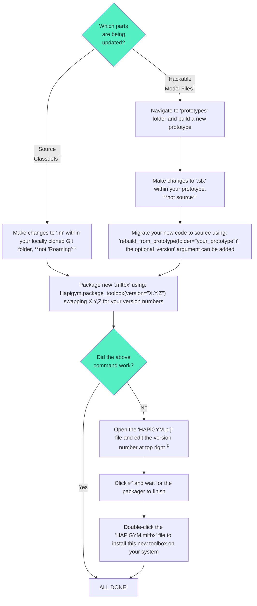

[Back to documentation home-page](https://github.com/HAPiWEC/HAPiGYM_docs/blob/main/README.md)

# 1. Maintaining the MATLAB Toolbox

> **Please note:**
> 
> Developers require access to the [HAPiGYM source code repo](https://github.com/HAPiWEC/HAPiGYM). All instrunctions below assume that developer is working from a Git-linked clone of the master branch.

## Overview <sup>*tl;dr*</sup>

Below is a summary of the updating process for the Toolbox. You may find that you've already started this process (e.g. built and edited a prototype). If so, use the chart below as a guide through the remainder of the process.





> † &ensp;See below for descriptions of *'Source Classdefs'* and *'Hackable Model Files'* <br>
> ‡ &ensp;You may also want to check other settings within this view if you experience further issues

## Understanding two key parts to the source code

There are two parts to the source code that should be treated differently when maintaining:

- **Source Classdefs -** The MATLAB `classdef` files which encapsulate all the toolbox functions (methods);
- **Hackable Model Files -** The Simulink files (plus some `.mat` files) which define the user's hackable model.

An important way to think about this difference is to consider the end-user's system. 
- **Regarding 'Source Classdefs' -** an end-user will have <u>***only one copy***</u> of these files, located in their `MATLAB Add-Ons` directory. All the methods that are contained wihtin the `classdef`s are accessible as soon as MATLAB opens a new session (via `Hapigym.{method_name}`, `Waves.{method_name}`, etc.). These files are always implicitly linked to the version of the Toolbox that the user has installed (this is managed by MATLAB using its standard Add-Ons process).
- **Regarding 'Hackable Model Files' -** the user can have many copies of these hackable files on their system, one copy for each of the *"projects"* they have created. Due to the nature of the HAPiGYM Toolbox, it is important that the user can open and (potentially) edit these files - this set of Simulink and `.mat` files define the model, so they need to be replicated every time we consider a new model. When a user [builds a new model](https://github.com/HAPiWEC/HAPiGYM_docs/blob/main/Pages/Getting-started/1-Quick-start.md), a set of these hackable files are placed in the new project folder on the user's local system.


## Making changes to 'Source Classdefs'

1. Open the relevant `.m` file from the root of your development folder (e.g. `Hapigym.m`, `PTO.m` etc.). This must be the folder that you cloned directly from GitHub, and should also contain the `.git` folder and `.gitignore` file.
2. Make your new changes directly to this file.
3. Make a decision on your version number. If you have made no changes to the code that changes the behaviour (e.g. change/add code comments, change the name of an internal variable etc.), you can consider keeping the same version as previous. Otherwise, you can increment the third value ('Z') to the next number if the change, the second value ('Y') if you have reached a significant new version, and the first value ('X') if a major overhaul/landmark has been implemented. Version 'v1.0.0 should be reserved for a post beta-testing.
4. Generate a new Toolbox file using the following command (swapping X,Y,Z for your version numbers):
   ```
   Hapigym.package_toolbox(version=''X.Y.Z'')
   ```
5. Test.
6. Commit the latest changes locally using Git (you don't need to mention the new vX.Y.Z number - this should be in the commit tag - see below).
7. [Optional] Tag the relevant commit using the new vX.Y.Z number (if this has changed)
8. Copy the `Hapigym.mltbx' file to the 'Hapigym_docs' repo

## Making changes to 'Hackable Model Files'

The specific process for this is more involved than for changing 'Source Classdefs', this is covered in the next section.

[Next page (Update SLXs using a prototype)](https://github.com/HAPiWEC/HAPiGYM_docs/blob/main/Pages/Developer-instructions/2-Update-SLXs-using-a-prototype.md)
